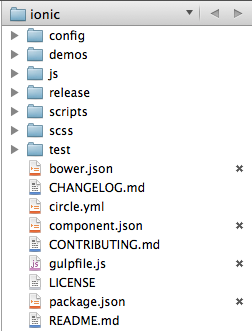

Chapter 1：初始ionic
===========


## 目录说明




```
➜  ionic git:(master) ls -l | awk '{print $9}'
CHANGELOG.md
CONTRIBUTING.md
LICENSE
README.md
bower.json
circle.yml
component.json
config
demos
gulpfile.js
js
package.json
release
scripts
scss
test
```

### 文件部分

|编号|名称|描述|
|----|-----|-----|
|1|CHANGELOG.md|版本变更说明|
|2|CONTRIBUTING.md|贡献代码人名单|
|3|LICENSE|开源协议|
|4|README.md|说明文件（必读）|
|5|bower.json|[Bower](http://bower.io/) A package manager for the web|
|6|circle.yml|[circleci配置文件]( https://circleci.com/docs/configuration)|
|7|component.json|[component](https://github.com/component/component) - client package management for building better web application|
|10|gulpfile.js|[gulp.js The streaming build system](gulpjs.com)|
|12|package.json|Specifics of [npm's package.json](https://www.npmjs.org/doc/package.json.html) handling|

作业：整理出下面技术的helloworld，了解每个技术是做什么的以及用于什么场景。

- bower helloworld
- circle ci helloworld
- component helloworld
- gulp helloworld（grunt helloworld）
- npm helloworld


### 目录部分

|编号|名称|描述|
|----|-----|-----|
|8|config|配置|
|9|demos|示例|
|11|js|js源码|
|13|release|发布包|
|14|scripts|脚本|
|15|scss|样式|
|16|test|测试|


## 参考资源

bower

- http://chuo.me/2013/02/twitter-bower.html
- http://blog.javachen.com/2014/05/10/bower-intro/

