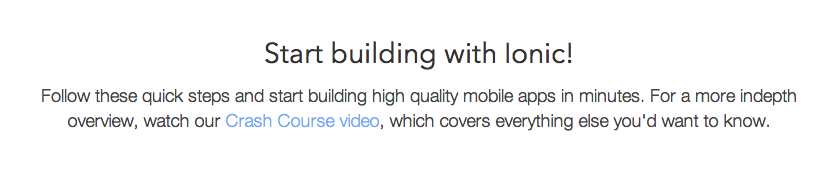
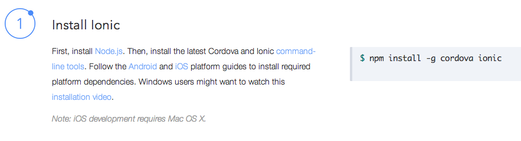
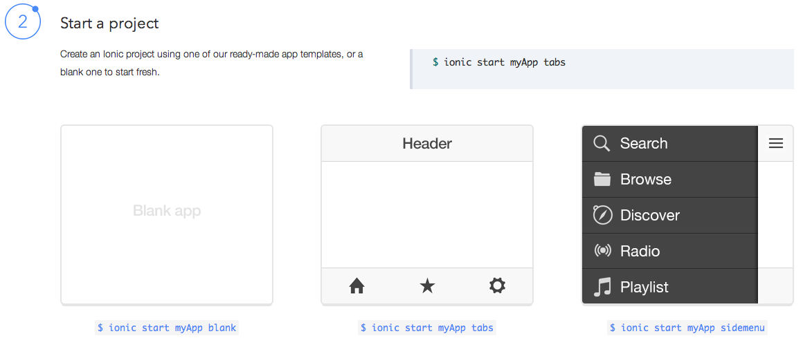
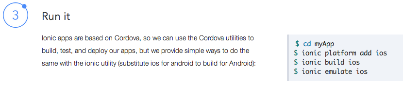
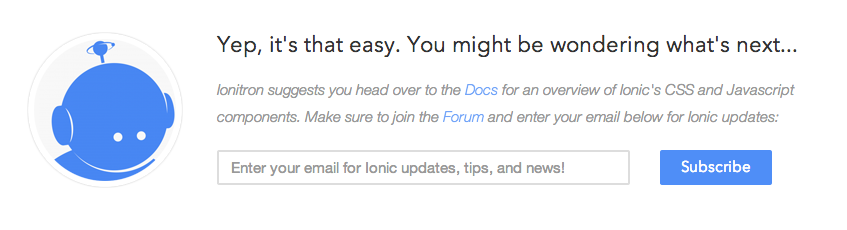

Chapter 1：getting started
===========

getting started翻译过来的意思是入门，也就是假设你对它一无所知的时候，从头开学的地方。

http://ionicframework.com/getting-started/


## 欢迎新同学



```
Start building with Ionic!
Follow these quick steps and start building high quality mobile apps in minutes. For a more indepth overview, watch our Crash Course video, which covers everything else you'd want to know.
```

这是一段概述，告诉你说接下来我们做什么，如何快速入门，如果你想找更高级的道路，给出方向。


## 探索着过河

### 如何安装ionic



其实就一个命令

	npm install -g cordova ionic
	
但是你真的懂么？


- 什么是npm么？
- 了解npm依赖node么
- 知道`-g`代表什么意思么？

如果知道跳过下一章节

首先要知道nom的全称是node package manager,从字面意思很明显就知道它是nodes的包管理器。那么你肯定需要安装nodejs了，文中有链接自行下载







## 以后的路要考自己了

