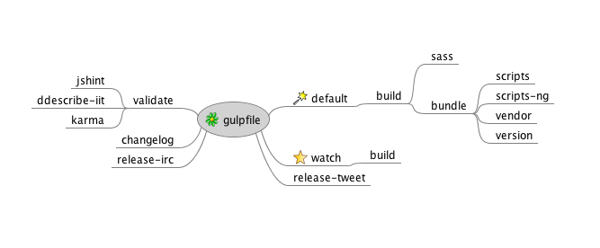

# 如何修改ionic源码

## 修改源码通常做法


Contributing

1. Fork it
1. Create your feature branch (git checkout -b my-new-feature)
1. Commit your changes (git commit -am 'Add some feature')
1. Push to the branch (git push origin my-new-feature)
1. Create new Pull Request

这样视项目而定的，没准ionic里有更好玩的东西呢

## 阅读源码，了解其build机制

在ionic里它使用的是gulp做build工具。原因很简单，在根目录下有一个gulpfile.js。

## 了解常用构建方法，更好的理解gulp

比如make,ant,rake,cake等，只要你熟悉其中一个，gulp就非常好上手

在我看来gulp比grunt要好用的最好的地方就是和上面的工具像，学习成本低好多。

看一下新手指南：
https://github.com/i5ting/js-tools-best-practice/tree/master/doc

目的是学会gulp

## 阅读gulpfile


### 任务依赖

```
gulp.task('default', ['build']);
gulp.task('build', ['bundle', 'sass']);
gulp.task('validate', ['jshint', 'ddescribe-iit', 'karma']);
```

这是核心的task，首先说明default是build，就是gulp命令什么都不加的时候，相当于执行gulp build

从上面的代码我们还可以获得一个结论是build是由bundle和sass这2个作业组成的，并且bundle在前面执行，执行完成才好执行sass

### 查看某个task定义

#### 有依赖的task定义

```
gulp.task('bundle', [
  'scripts',
  'scripts-ng',
  'vendor',
  'version',
], function() {
	
	....
```

这里顶一个bundle的做法，它是依赖4个task，他们都完成后才会执行callback里的内容

#### 无依赖的task定义

```
gulp.task('sass', function(done) {
  gulp.src('scss/ionic.scss')	
```

这个定义的就非常简单

### 作业关系



说明

- 核心作业是build
- watch和validate是辅助开发的
- 其他是工具类task

## 详读task源码

### 阅读watch的源码

如果各位熟悉bdd或者rails里的自动化测试的话，可能了解ruby中得watch，guard之类的

这里的gulp-watch做的也是一样的功能，即当**变动，然后完成某些操作。

```
gulp.task('watch', ['build'], function() {
  IS_WATCH = true;
  gulp.watch('js/**/*.js', ['bundle']);
  gulp.watch('scss/**/*.scss', ['sass']);
});
```

这里面的意思是说

- watch依赖于build，执行watch之前必然先build好包
- 当js目录下的所有js变动，都会触发bundle task
- 当sass目录下的所有scss变动，都会触发sass task

我觉得看到这里你可以理解为啥build是要分bundle和sass这2个作业了。

- bundle是给js打包的
- sass是给scss编译成css后打包的

### 阅读bundle源码

```
gulp.task('bundle', [
  'scripts',
  'scripts-ng',
  'vendor',
  'version',
], function() {
  gulp.src(buildConfig.ionicBundleFiles.map(function(src) {
      return src.replace(/.js$/, '.min.js');
    }), {
      base: buildConfig.dist,
      cwd: buildConfig.dist
    })
      .pipe(header(buildConfig.bundleBanner))
      .pipe(concat('ionic.bundle.min.js'))
      .pipe(gulp.dest(buildConfig.dist + '/js'));

  return gulp.src(buildConfig.ionicBundleFiles, {
    base: buildConfig.dist,
    cwd: buildConfig.dist
  })
    .pipe(header(buildConfig.bundleBanner))
    .pipe(concat('ionic.bundle.js'))
    .pipe(gulp.dest(buildConfig.dist + '/js'));
});

```

这里面主要是

	.pipe(gulp.dest(buildConfig.dist + '/js'));
	
这句的意思是gulp最终压缩后生成的文件目录在哪里。

这里使用了ionicBundleFiles配置文件，那么我们就需要找到

	buildConfig.dist
	
### buildConfig.dist

see config/build.config.js

```
var pkg = require('../package.json');
var fs = require('fs');

module.exports = {
  dist: 'dist',
  releasePostUrl: fs.readFileSync('config/RELEASE_POST_URL'),

  protractorPort: 8876,

```

至此我们找到`dist: 'dist'`

我们可以执行gulp build看看是否是生成文件在dist目录下

### 为什么费尽周折的找dist呢？

了解watch，就知道它在文件变动的时候自动编译。也就是说我编辑ionic的源码会自动编译到dist目录。

那么如果dist是我的项目里ionic的目录呢？

一切都是为了源码的custom编译啊。

## 


