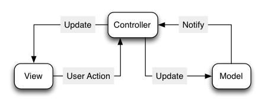
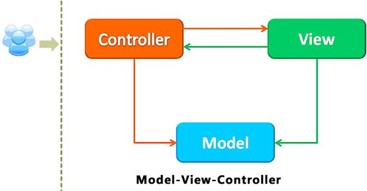
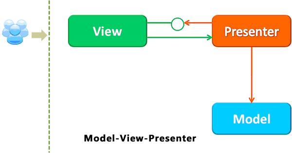
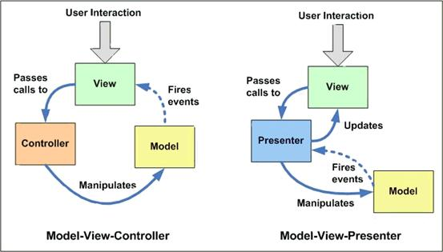
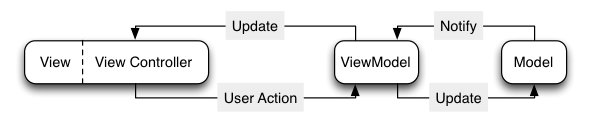

# 模式进化演变

## Model-View-Controller

Model-View-Controller是一个用来组织代码的权威范式。Apple甚至是这么说的(https://developer.apple.com/library/ios/documentation/general/conceptual/devpedia-cocoacore/MVC.html)。在MVC下，所有的对象被归类为一个model，一个view，或一个controller。Model持有数据，View显示与用户交互的界面，而view controller调解model和view之间的交互。

在上图中，view将用户交互通知给controller。view controller通过更新model来反应状态的改变。model（通常使用Key-Value-Observation）通知controller来更新他们负责的view。

大多数应用程序的代码使用这种方式来组织。
Controller是app的“胶水代码”：协调模型和视图之间的所有交互
由于大量的代码被放进view controller，导致他们变的相当臃肿。

## Model-View-Presenter

MVP 模式将 mvc 里的 Controller 改名为 Presenter，同时改变了通信方向。

1. 各部分之间的通信，都是双向的。
2. View 与 Model 不发生联系，都通过 Presenter 传递。
3. View 非常薄，不部署任何业务逻辑，称为"被动视图"（Passive View），即没有任何主动性，而 Presenter非常厚，所有逻辑都部署在那里。

对比一下mvc

## Model-View-ViewModel

MVVM 模式将 Presenter 改名为 ViewModel，基本上与 MVP 模式完全一致。

唯一的区别是，它采用双向绑定（data-binding）：View的变动，自动反映在 ViewModel，反之亦然。Angular 和 Ember 都采用这种模式。

在理想的世界里，MVC也许工作的很好。然而，我们生活在真实的世界。既然我们已经详细说明了MVC在典型场景中的问题，那让我们看一看一个可供替换的选择：Model-View-ViewModel。

MVVM来自微软(http://msdn.microsoft.com/en-us/library/hh848246.aspx)，不过不要坚持反对它。MVVM和MVC很像。它正式规范了视图和控制器紧耦合的性质，并引入新的组件。

在MVVM里，view和view controller正式联系在一起，我们把它们视为一个组件。视图view仍然不能直接引用模型model，当然controller也不能。相反，他们引用视图模型view model。

在这种设计模式中，

- 模型来负责业务逻辑和数据封装。
- 视图模型在模型的基础上对模型数据进行封装，并定义了显示层的逻辑。它负责模型与视图的交互。
- 视图则只负责界面和显示。

