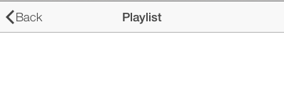
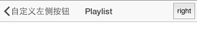
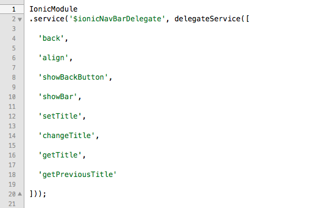
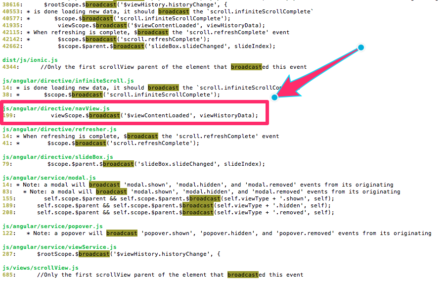
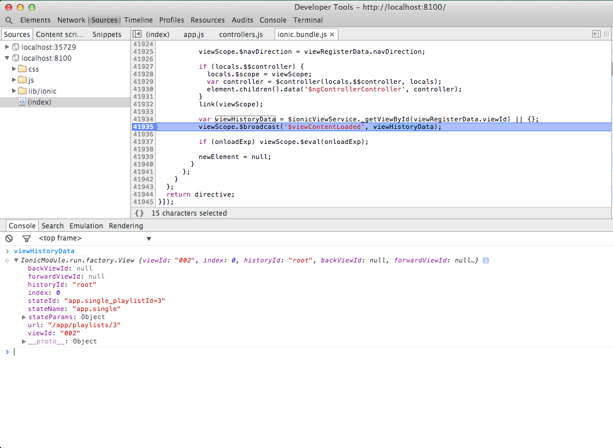
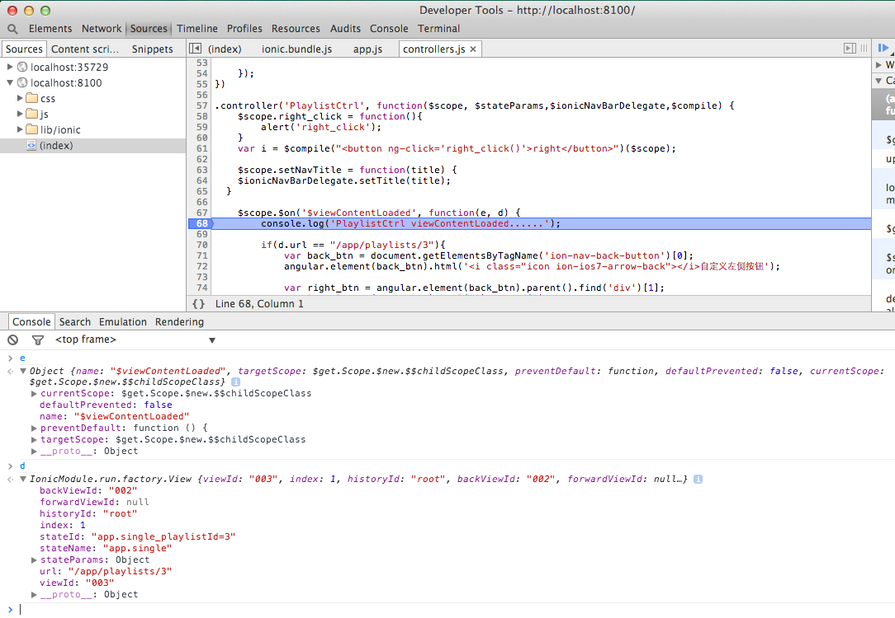
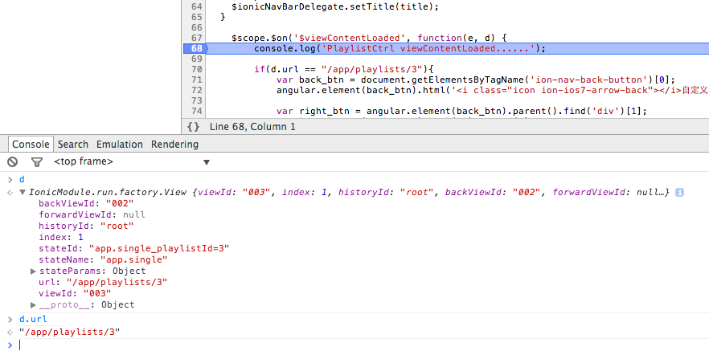

# Side Menu

创建以及基本调试，请看第二章节

本章主要讲解在sidemenu项目里如何更改headerview里的按钮

## 需求

在ionic的navview里，只要是推进得试图，左侧都是



但是我们大部分时候都需要改变左右按钮的，比如

左侧变化


右侧变化



## 如果想改变，能有几种办法呢？

我想到的是2种

1. 修改源码
2. 利用nav的生命周期

## 翻查文档

ionic给nav留出的借口只有`$ionicNavBarDelegate`

see http://ionicframework.com/docs/api/service/$ionicNavBarDelegate/

去除注释的代码，如下



就只有8个方法，根本没办法修改左右按钮。

## 查看navView.js

```
IonicModule.constant('$ionicNavViewConfig', {
  transition: 'slide-left-right-ios7'
});

IonicModule
.directive('ionNavView', [
  '$ionicViewService',
  '$state',
  '$compile',
  '$controller',
  '$animate',
function( $ionicViewService,   $state,   $compile,   $controller,   $animate) {
  // IONIC's fork of Angular UI Router, v0.2.7
  // the navView handles registering views in the history, which animation to use, and which
  var viewIsUpdating = false;

  var directive = {
    restrict: 'E',
    terminal: true,
    priority: 2000,
    transclude: true,
    controller: function(){},
    compile: function (element, attr, transclude) {
      return function(scope, element, attr, navViewCtrl) {
        var viewScope, viewLocals,
          name = attr[directive.name] || attr.name || '',
          onloadExp = attr.onload || '',
          initialView = transclude(scope);

        // Put back the compiled initial view
        element.append(initialView);

        // Find the details of the parent view directive (if any) and use it
        // to derive our own qualified view name, then hang our own details
        // off the DOM so child directives can find it.
        var parent = element.parent().inheritedData('$uiView');
        if (name.indexOf('@') < 0) name  = name + '@' + ((parent && parent.state) ? parent.state.name : '');
        var view = { name: name, state: null };
        element.data('$uiView', view);

        var eventHook = function() {
          if (viewIsUpdating) return;
          viewIsUpdating = true;

          try { updateView(true); } catch (e) {
            viewIsUpdating = false;
            throw e;
          }
          viewIsUpdating = false;
        };

        scope.$on('$stateChangeSuccess', eventHook);
        // scope.$on('$viewContentLoading', eventHook);
        updateView(false);

        function updateView(doAnimate) {
          //===false because $animate.enabled() is a noop without angular-animate included
          if ($animate.enabled() === false) {
            doAnimate = false;
          }

          var locals = $state.$current && $state.$current.locals[name];
          if (locals === viewLocals) return; // nothing to do
          var renderer = $ionicViewService.getRenderer(element, attr, scope);

          // Destroy previous view scope
          if (viewScope) {
            viewScope.$destroy();
            viewScope = null;
          }

          if (!locals) {
            viewLocals = null;
            view.state = null;

            // Restore the initial view
            return element.append(initialView);
          }

          var newElement = jqLite('<div></div>').html(locals.$template).contents();
          var viewRegisterData = renderer().register(newElement);

          // Remove existing content
          renderer(doAnimate).leave();

          viewLocals = locals;
          view.state = locals.$$state;

          renderer(doAnimate).enter(newElement);

          var link = $compile(newElement);
          viewScope = scope.$new();

          viewScope.$navDirection = viewRegisterData.navDirection;

          if (locals.$$controller) {
            locals.$scope = viewScope;
            var controller = $controller(locals.$$controller, locals);
            element.children().data('$ngControllerController', controller);
          }
          link(viewScope);

          var viewHistoryData = $ionicViewService._getViewById(viewRegisterData.viewId) || {};
          viewScope.$broadcast('$viewContentLoaded', viewHistoryData);

          if (onloadExp) viewScope.$eval(onloadExp);

          newElement = null;
        }
      };
    }
  };
  return directive;
}]);

```

它的实际代码就这点，所以看起来不是很费解。就算你看不明白，那总能看明白下面这句吧

	viewScope.$broadcast('$viewContentLoaded', viewHistoryData);
	
viewContentLoaded的意思是view得内容面板里的内容加载已完成。实际上这就是nav里加载完成而广播出去的生命周期。整个nav就只有这个，它没有严格的其他生命周期。

如果各位对生命周期有兴趣的话，可以

	ack broadcast
	



## 关于broadcast

### 回顾
事件发送的方法：

	$scope.$broadcast

值得注意的是发送的主语是 $scope， 因为所有的事件其实都是作用在scope上的。

broadcast 是从发送者向他的子scope发送时间的一个方法。 这里就是SelfCtrl发送， SelfCtrl 和 ChildCtrl 会接受到, 而ParentCtrl是不会收到的

事件的接受只有一个方法

	$scope.$on

具体参见第四章angularjs中得event章节

### 实现

```
.controller('PlaylistsCtrl', function($scope) {
  $scope.playlists = [
    { title: '默认方式', id: 1 },
    { title: '自定义返回且无右侧按钮', id: 2 },
    { title: '自定义返回和右侧按钮', id: 3 }
  ];
	
	$scope.$on('$viewContentLoaded', function(e, d) {
	  console.log('PlaylistsCtrl viewContentLoaded......');
	});
})
```

### 详解

事件发送

```
js/angular/directive/navView.js
199:          viewScope.$broadcast('$viewContentLoaded', viewHistoryData);
```

事件接受

```
	$scope.$on('$viewContentLoaded', function(e, d) {
	  console.log('PlaylistsCtrl viewContentLoaded......');
	});
```

这里需要把e和d这二个参数说明一下

首先看一下事件发送的地方传了什么参数




再看一下事件接收的地方e和d分别是什么




这一切可变的根源就在于viewHistoryData，最核心的是它的url


	
## 完善demo

既然是nav这种方式,它的生命周期把history数据传到事件接受参数里，那么我们就可以根据此
完成我们自己的需求，具体见代码吧

```
.controller('PlaylistsCtrl', function($scope) {
  $scope.playlists = [
    { title: '默认方式', id: 1 },
    { title: '自定义返回且无右侧按钮', id: 2 },
    { title: '自定义返回和右侧按钮', id: 3 }
  ];
	
	$scope.$on('$viewContentLoaded', function(e, d) {
	  console.log('PlaylistsCtrl viewContentLoaded......');
	
		// var right_btn = document.getElementsByTagName('div').hasClass('right-buttons');
		if(d.url == "/app/playlists"){
			var back_btn = document.getElementsByTagName('ion-nav-bar')[0];	
		
			var right_btn = angular.element(back_btn).find('div')[1];
			angular.element(right_btn).html('');
		}

	});
})

.controller('PlaylistCtrl', function($scope, $stateParams,$ionicNavBarDelegate,$compile) {
 	$scope.right_click = function(){
 		alert('right_click');
 	}
	
	
	$scope.setNavTitle = function(title) {
    $ionicNavBarDelegate.setTitle(title);
  }

	$scope.$on('$viewContentLoaded', function(e, d) {
		console.log('PlaylistCtrl viewContentLoaded......');
	
		if(d.url == "/app/playlists/2"){
			var back_btn = document.getElementsByTagName('ion-nav-back-button')[0];	
			angular.element(back_btn).html('<i class="icon ion-ios7-arrow-back"></i>返回');
			
			var right_btn = angular.element(back_btn).parent().find('div')[1];
			angular.element(right_btn).html('').html('');
			
		}else{
			var back_btn = document.getElementsByTagName('ion-nav-back-button')[0];	
			angular.element(back_btn).html('<i class="icon ion-ios7-arrow-back"></i>Back');
			
			var right_btn = angular.element(back_btn).parent().find('div')[1];
			angular.element(right_btn).html('').html('');
		}

	});
	 
})
```

### 动态增加右侧菜单和绑定事件

```
.controller('PlaylistCtrl', function($scope, $stateParams,$ionicNavBarDelegate,$compile) {
 	$scope.right_click = function(){
 		alert('right_click');
 	}
	var i = $compile("<button ng-click='right_click()'>right</button>")($scope);
 
	$scope.$on('$viewContentLoaded', function(e, d) {
		console.log('PlaylistCtrl viewContentLoaded......');
		
		if(d.url == "/app/playlists/3"){	
			var back_btn = document.getElementsByTagName('ion-nav-back-button')[0];	
			angular.element(back_btn).html('<i class="icon ion-ios7-arrow-back"></i>自定义左侧按钮');
		
			var right_btn = angular.element(back_btn).parent().find('div')[1];
			angular.element(right_btn).html('').append(i);
		}

	});
	 
})
```

这里面有用到`$compile`技术，它是用于编译angularjs模板的。

	var i = $compile("<button ng-click='right_click()'>right</button>")($scope);
	
这样就可以创建出html模板，并把click事件绑定到right_click上了

下面通过dom插入到页面中即可

	angular.element(right_btn).html('').append(i);

## 总结

整个过程难度适中，但是要阅读大量ionic代码，而且ionic自己文档不全，还是蛮考验人的。

还是应该好好掌握angular基础的，ionic假定的是你精通angular。
